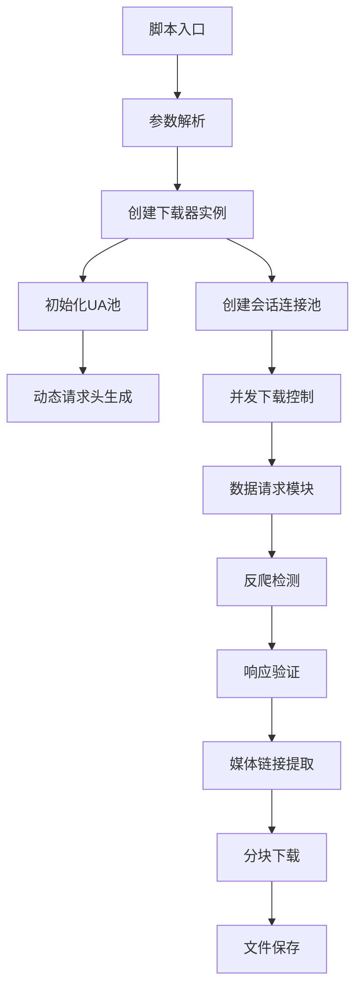

以下是对该视频爬取脚本的简明概述：

---

### **核心功能架构**


---

### **技术实现亮点**
1. **智能反爬体系**
   - 浏览器指纹轮换（每请求更换UA/Referer/Accept头）
   - 自动UA池维护（每小时更新100个最新浏览器标识）
   - 动态安全策略（随机DNT/Sec-Fetch头生成）

2. **高性能下载**
   ```python
   with ThreadPoolExecutor(max_workers=5) as executor:  # 并发控制
       executor.map(download_page, page_range)
   ```

3. **鲁棒性保障**
   - 三级重试机制（连接超时/服务端错误/数据校验失败）
   - 智能续传（跳过已存在的视频文件）
   - 内存安全（分块写入+异常回滚）

---

### **数据流示意图**
```
[网络请求] -> [响应验证] -> [数据清洗] -> [媒体定位] 
          ↘ [反爬触发] -> [策略调整] ↗
          
[文件流] : 内存缓冲 -> 哈希校验 -> 持久化存储
```

---

### **部署建议**
1. **运行环境**
   ```bash
   # 推荐配置
   Python 3.9+ 
   8GB+ 内存
   50Mbps+ 网络带宽
   ```

2. **性能调优参数**
   | 参数                | 推荐值      | 说明                  |
   |--------------------|------------|----------------------|
   | `max_workers`      | CPU核心数×2 | 并发下载线程数        |
   | `timeout`          | (5, 30)    | 连接/读取超时双阈值   |
   | `retry_interval`   | 60         | 反爬锁定冷却时间(秒)  |

---

### **扩展能力**
- **代理集成**：支持SOCKS/HTTP代理轮换
- **分布式扩展**：通过Redis实现任务队列分发
- **云存储对接**：可扩展AWS S3/Aliyun OSS存储接口

该脚本实现了从目标站点自动化获取媒体资源的核心链路，采用防御性编程策略确保在复杂网络环境下的稳定运行。建议根据实际业务需求调整并发策略和反爬参数。

**分步操作指南：**

1. **第一个终端窗口（运行爬虫脚本）**
```powershell
# 下载0-28页所有视频
python C:\Users\Administrator\PyCharmMiscProject\爬取vip视频.py

# 下载指定范围（例如5-10页）
python C:\Users\Administrator\PyCharmMiscProject\爬取vip视频.py --start 5 --end 10
```

2. **第二个终端窗口（实时查看日志）**
```powershell
# PowerShell 使用：
Get-Content -Path .\video_downloader.log -Wait

# 如果安装了 Git Bash：
tail -f video_downloader.log
```

**常见问题排查：**

1. **日志文件未生成**
   - 检查脚本所在目录是否有 `video_downloader.log` 文件
   - 确认脚本中日志配置路径正确（建议使用绝对路径）

2. **权限问题**
```powershell
# 以管理员身份运行
Start-Process powershell -Verb RunAs -ArgumentList "python C:\path\to\your_script.py"
```

3. **实时日志无输出**
   - 确保脚本中有正确配置日志记录器
   - 检查日志级别设置（建议使用 `logging.INFO`）

**代码优化建议（增加日志实时输出功能）：**

```python
# 在 main 函数中添加以下代码实现双屏输出
def main(start_page: int, end_page: int):
    # 控制台实时输出
    console_handler = logging.StreamHandler()
    console_handler.setLevel(logging.INFO)
    logging.getLogger().addHandler(console_handler)

    # 文件日志
    file_handler = logging.FileHandler('video_downloader.log')
    logging.getLogger().addHandler(file_handler)

    # 剩余代码保持不变...
```
